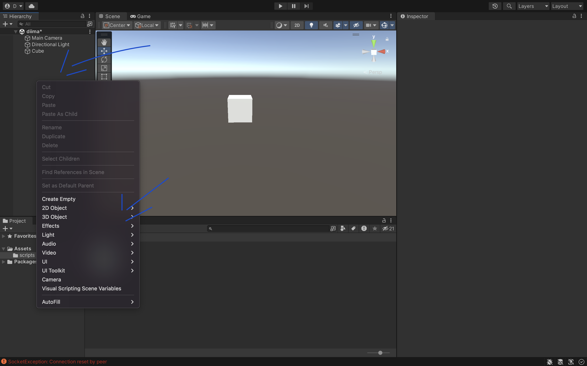
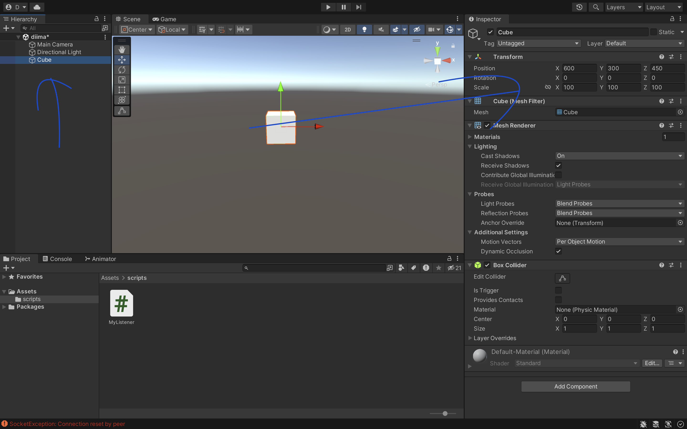
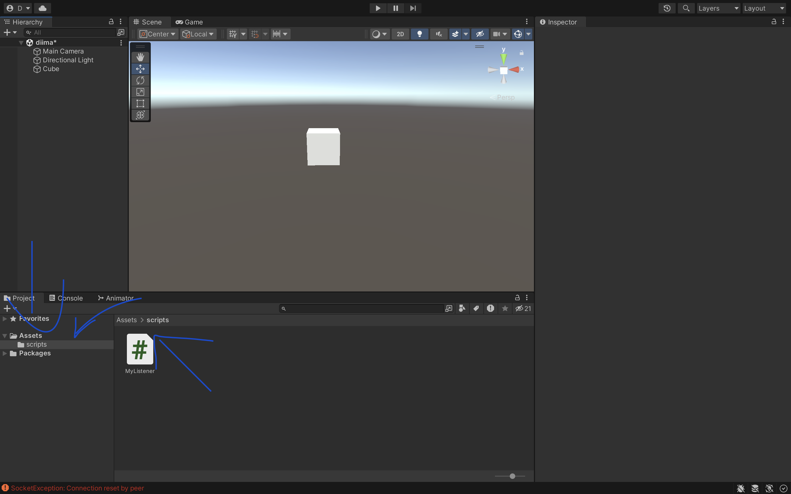
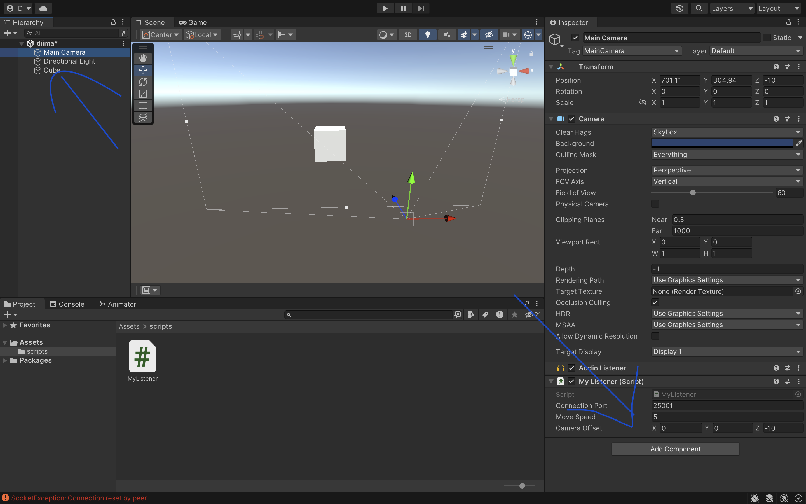

# Setup Guide

1. **Install Unity and Open It**

 

2. **Check the Hierarchy Table at the Top Left**

   Right-click on it -> 3D Object -> Cube or any other object.
3.   

3. **Select the Cube**

   In the Inspector screen on the right, change its position to:
    - X: 600
    - Y: 300
    - Z: 450

   Change the scale to:
    - X: 100
    - Y: 100
    - Z: 100
    - 

   

4. **Navigate to the Project Folders**

   Click on **Assets**. If you do not have a **Scripts** folder, create one, then paste the `MyListener.cs` into this folder.

   

5. **Navigate Back to the Hierarchy Table**

   Click on **Main Camera**, then at the bottom of the Inspector on the left screen, press on **Add Component** and choose **MyListener**.

   

6. **Run the Unity Project**

   First, run the Unity project, then run the Python file, in this order.

   

